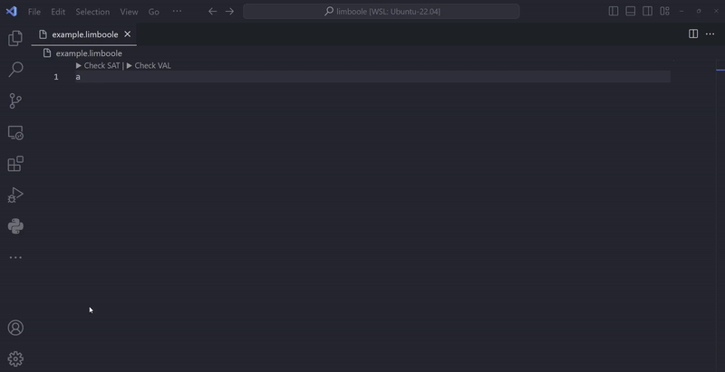

# Limboole Extension for Visual Studio Code

Limboole is a tool for checking satisfiability and tautology in arbitrary structural boolean formulas, and can also translate these problems into CNF. For more information, see the [Limboole website](https://fmv.jku.at/limboole/).

If you prefer to use Limboole online, you can use the [FM Playground](https://play.formal-methods.net/). It offers a web interface for Limboole and other formal methods tools.

## Features

This extension allows you to run Limboole from within Visual Studio Code. 

## Usage

For `.limboole` files, you can check satisfiability and validity of the formula by clicking on the `▶ Check SAT` and `▶ Check VAL` buttons in top left corner of the editor. The result will be displayed in the output window. For other file types e.g. .txt, you can run Limboole by opening the command palette (Ctrl+Shift+P) and typing `Limboole: ...`. You can check *satisfiability*, *validity*, and *CNF translation* of the formula.

## Requirements

This extension is packaged with Limboole executable for Windows, Linux, and macOS. If you have different operating system, you can download the latest version from the [Limboole website](https://fmv.jku.at/limboole/) and set the path to the executable in the settings.

## Settings

You can set the path to the Limboole executable in the settings. Open the settings by clicking on the gear icon in the bottom left corner of the window, then click on `Extensions` and `Limboole`. You can also open the settings by pressing `Ctrl+,` and typing `Limboole` in the search bar.

## Known Issues

The extension is tested on Windows and Linux. Unfortunately, I don't have access to macOS, so I can't test it there. If you encounter any issues, please report them on [GitHub](https://github.com/soaibsafi/limboole-vscode/issues) or open a PR.

## License

This extension is licensed under the MIT License. See [LICENSE](LICENSE) for more information.

### Limboole License
There is no specific license for the Limboole SAT solver front-end software. It is provided "as is" and can be used in any way without warranty of any kind.

However, linking against Lingeling and PicoSAT will produce a binary, which falls under the license restrictions of those tools, which are more restricted.

Refer to the [Limboole License](https://github.com/maximaximal/limboole/blob/master/LICENSE) for more information.
